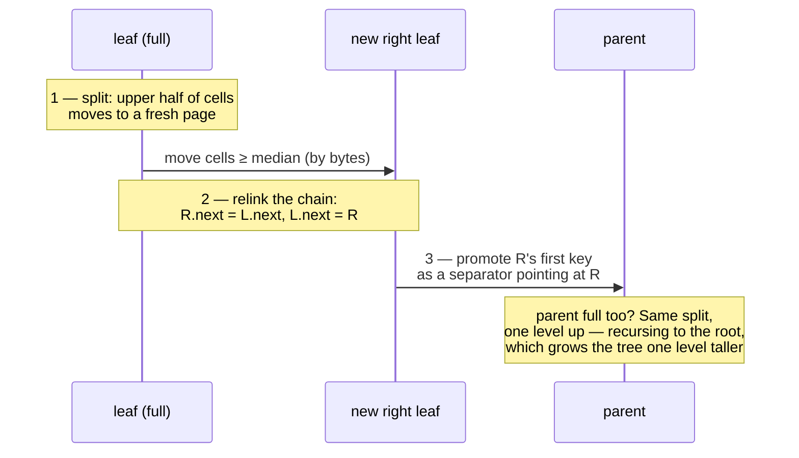

# The B+Tree

This is the page the whole project was built to earn. BisonDB's indexes are a hand-written,
on-disk B+Tree — no `std::map` standing in for the hard part, no storage library. It maps
**encoded key bytes → small values** (a log offset for the `_id` index; nothing at all for
secondary indexes, whose keys are self-contained) and is verified by 100,000-operation
randomized fuzzing against `std::map` as an oracle.

## Why a B+Tree at all

| | Hash index | **B+Tree** | LSM tree |
|---|---|---|---|
| Point lookup | O(1) | O(log n) | O(log n), multi-level |
| **Range scan** | impossible | **sequential leaf walk** | merge across levels |
| Ordered iteration | no | yes | yes |
| Write pattern | random | random page writes | append-only, compaction |
| Implementation size | small | **moderate** | large (levels, bloom, merge) |
| Used by | Redis hashes, Python dict | SQLite, Postgres, MySQL | RocksDB, Cassandra |

Queries like `{pop: {$gte: 40000}}` are *range* queries — a hash index cannot answer them
at all (BisonDB's Phase-2 startup hash could only find exact `_id`s). An LSM tree wins on
write-heavy workloads but costs far more machinery. The B+Tree is the smallest structure
that makes range queries cheap, which is exactly what `explain`'s
`29470 → 1015 docsExamined` collapse demonstrates.

## Pages and the pager

An index file is an array of fixed **4096-byte pages**. Page 0 is the header (magic
`BSNI`, root page id, free-list head, page count, and the clean flag from the
[storage page](/architecture/storage)). Freed pages form a linked free list and are reused
before the file grows. A small LRU cache (256 pages) with write-back keeps hot pages in
memory; `sync` flushes dirty pages, fsyncs, then sets the clean flag.

## Node layout: slotted pages

Both node kinds share one layout — a 12-byte header, a growing slot array, and cells
growing backward from the page end:

```
offset 0                                                        4096
┌────────────┬───────────────────────┬─────────┬────────────────┐
│ header 12B │ slot array (u16 × n)  │  free   │ cells ←        │
│            │ sorted by key, grows →│  space  │ grow backward  │
└────────────┴───────────────────────┴─────────┴────────────────┘
```

| Header offset | Field |
|---|---|
| 0 | node type: 1 = leaf, 2 = internal |
| 2–3 | cell count (u16) |
| 4–5 | free-space offset — the lowest cell start |
| 8–11 | leaf: right-sibling page id · internal: rightmost child id |

A **leaf cell** is `keyLen u16 │ key │ valLen u16 │ value`. An **internal cell** is
`keyLen u16 │ key │ childPageId u32`, where the child holds keys *less than* the cell's
key, and the header's rightmost child catches everything ≥ the last separator.

Why slots instead of packed records? Binary search needs random access to the *i*-th key,
but keys are variable-length. The slot array gives O(log n) search over offsets that are
cheap to shift on insert; deleting a cell just removes its slot and leaves a hole, and a
page compacts its cell area only when a later insert actually needs the space.

Leaves are also chained left-to-right through the sibling pointer — that single u32 per
page is what turns "find the start of the range" into "now just keep reading."

## Key encoding

The tree compares keys with plain `memcmp`. All type-aware ordering is pushed into the
encoding, which must therefore be *order-preserving*: encoded bytes compare exactly like
the values they represent. Each key starts with a type-class tag (giving the cross-type
order Null < Numbers < String < ObjectId < Bool < DateTime), then a payload:

| Type | Encoding |
|---|---|
| Numbers | Int32/Int64/Double normalized to double, bits transformed (below), big-endian |
| String | UTF-8 with `00` escaped as `00 FF`, terminated `00 00` |
| ObjectId | 12 raw bytes |
| Bool | one byte |
| DateTime | i64 + 2⁶³ bias, big-endian |

Keys cap at **512 encoded bytes**; longer values (and NaN, and documents/arrays) simply
aren't indexed — those documents are still found by full scans, and index builds count them
as skipped.

### The double sign-flip trick

IEEE 754 doubles almost sort like their bit patterns — for positive numbers. Negative
numbers have the sign bit set (so they'd sort *above* positives unsigned) and grow
*downward* in magnitude as their bit patterns grow. Two transformations fix both:

- sign bit **clear** (positive): set the sign bit → moves positives above all negatives
- sign bit **set** (negative): flip **all 64 bits** → reverses the negatives' order and
  clears their sign bit

| Value | IEEE bits | After transform | Unsigned order |
|---|---|---|---|
| −2.0 | `C000…0000` | `3FFF…FFFF` | smallest |
| −1.0 | `BFF0…0000` | `400F…FFFF` | ↑ |
| 0.0 | `0000…0000` | `8000…0000` | ↑ |
| 1.0 | `3FF0…0000` | `BFF0…0000` | ↑ |
| 2.0 | `4000…0000` | `C000…0000` | largest |

(−0.0 is normalized to +0.0 first so the two zeros collide, matching numeric equality.)
Stored big-endian, `memcmp` now sorts doubles numerically. The string escaping serves the
same master: `00→00 FF` with a `00 00` terminator keeps `"a" < "a\0" < "aa"` correct under
bytewise comparison even with embedded NULs. A 30,000-case fuzz test asserts
`memcmp(encode(a), encode(b))` agrees with a direct value comparator on random pairs.

### Composite keys for secondary indexes

A secondary index on `pop` stores `encode(popValue) ‖ 00 ‖ _id` — twelve extra bytes make
every key unique (duplicate field values differ in id), keep entries grouped by value, and
let a range scan recover the `_id` from the key itself without storing any cell value.

## Insertion and splits

Descent is standard: binary-search each internal node's separators, follow the child, insert
into the leaf. When a page can't fit the new cell even after compacting its holes, it
splits:



Leaf splits *copy* the separator up (the key stays in the leaf — range scans need every key
at leaf level); internal splits *move* their median up. A root split allocates a new root
with one separator, which is the only way this tree gets taller — so it grows perfectly
balanced, by construction.

## Deletion: deliberately lazy

Textbook B-trees rebalance on underflow — borrow from a sibling, else merge, possibly
cascading. BisonDB does something simpler: remove the cell, and only when a page hits
**zero** cells unlink it (stitch the sibling chain via its in-tree predecessor, drop the
parent's reference, collapse single-child roots).

The rationale is a cost/benefit honestly weighed: rebalancing buys back space *earlier*
but adds the most error-prone code in the textbook algorithm. Lazy deletion keeps pages
valid at all times (search and scans never care that a page is half-empty), reclaims
fully-empty pages through the free list, and leaves the worst case — a long-lived
half-empty tree after mass deletion — to the same `compact` operation the
[log already needs](/architecture/storage#compaction), which rebuilds indexes densely from
scratch. The 100k-op fuzz hammers exactly this path with mixed inserts and erases.

## Recovery, again

Nothing on this page changes the [storage layer's rule](/architecture/storage): the tree
flushes dirty pages on sync and marks itself clean; any crash leaves the flag unset, and the
next open throws the file away and rebuilds from the log. The B+Tree never has to be
*repairable* — only *detectably broken* — which removes an entire class of subtle
corruption bugs from the design space.

## Concurrency

One writer **or** many readers, enforced by a tree-level reader-writer lock; cursors hold
the read lock for their lifetime. Page-level latching (what production engines do) was
explicitly scoped out — see [concurrency](/architecture/concurrency).
