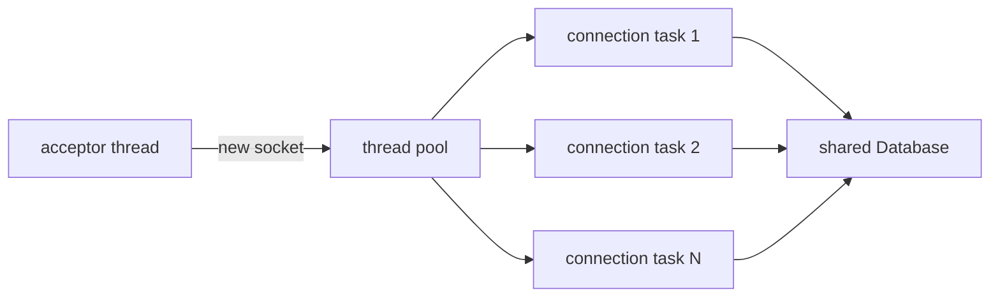

# Concurrency

BisonDB's concurrency story is deliberately conservative: coarse locks, clearly layered, in
exactly one process. This page states the model precisely, including what "single-process"
rules out.

## The server's threading shape

The acceptor hands each connection to a fixed thread pool (default: hardware concurrency);
a connection occupies one worker for its lifetime and processes its requests strictly in
order. Beyond the connection cap (default 64), new sockets get a `ServerBusy` frame and a
close. Exceptions never kill a worker; they become `Internal` error responses.

## The lock hierarchy

Three layers, each with one job:

| Layer | Lock | Protects |
|---|---|---|
| Collection | one readers-writer lock per collection | the *combination* of log + all its indexes |
| B+Tree | one readers-writer lock per tree | tree structure during a single operation |
| Pager / log | plain mutexes | the file handle and page cache underneath everything |

The collection lock is the one that matters for correctness: `insert`, `delete`, and
`update` take it exclusively and update the log **and every index** inside one critical
section, so readers can never observe a document that exists in the log but not in an
index, or vice versa. Reads take it shared.

Two practical notes from building it:

- **"Read-only" operations still mutate.** A page-cache hit reorders an LRU list, and a log
  read seeks a shared file handle. Both require their own internal mutexes. This was found the hard
  way when concurrent readers corrupted the cache list under load. Locks follow *mutation*,
  not the API's notion of "read."
- **Writer preference.** The readers-writer lock prefers waiting writers, so a stream of
  readers cannot starve a write forever. (The shipped implementation is hand-rolled over a
  mutex and condition variable after platform `shared_mutex` proved unreliable under
  contention on MinGW.)

## What this model costs

One writer per collection at a time: bulk writes serialize. Long-range scans hold a shared
lock that delays writers. Production engines fix this with page-level latching, MVCC
snapshots, or both; those were explicitly scoped out, because each replaces a provably
simple invariant ("the collection lock makes log+indexes atomic") with hundreds of subtle
ones. The 8-thread × 1000-operation integration soak validates the model that is claimed.

## Single-process means single-process

The data directory has no cross-process locking. Two `bisond` instances on one directory
will interleave appends and corrupt the recovery invariant. Run one server per data
directory and let every client go through it. That is the deployment model.
Multi-node replication is a different project; the [FAQ sketches](/reference/faq) what it
would take.
