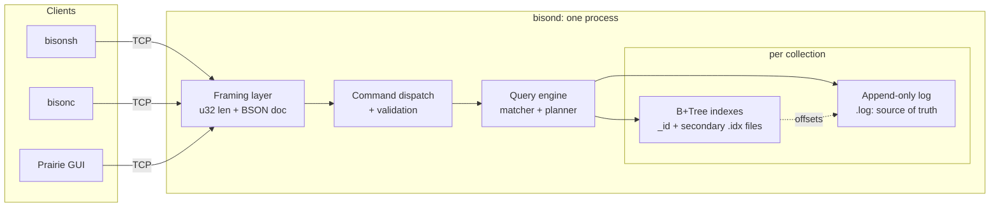

# Architecture overview

BisonDB is a single process owning a single data directory. Every client (the shell, the
converter, the GUI, and your scripts) speaks one framed-BSON protocol to it. This page is the
map; each component has its own deep-dive.

## The one design rule

**The log is the source of truth; everything else is a rebuildable cache.**

Documents live only in the append-only log. The `_id` B+Tree maps each id to a byte offset
in that log; secondary B+Trees map field values to ids. If any index file is missing,
corrupt, or was not closed cleanly, the server discards it and rebuilds it from the log. This
single rule makes crash recovery straightforward for a from-scratch database; there is
exactly one file whose integrity matters, and it is only ever appended to.

## Life of a query

`db.zips.find({pop: {$gte: 40000}})` with an index on `pop`:

1. **Framing**: the client sends one frame containing a 4-byte little-endian length, followed by one BSON
   document `{cmd: "find", coll: "zips", filter: {...}}`. Frames cap at 16 MiB.
2. **Dispatch**: the server validates every argument's presence and type before touching
   the engine; failures return typed error codes (`BadRequest`, `UnknownCommand`, ...).
3. **Planning**: the planner sees a range constraint on an indexed field and chooses an
   index range scan; otherwise it falls back to a full scan. No statistics or cost models are used, as
   the rules are simple enough to [state completely](/architecture/query-engine).
4. **Index scan**: the B+Tree seeks to the first key ≥ the encoded lower bound and walks
   leaf pages rightward until the upper bound, collecting `_id`s.
5. **Fetch + re-check**: each document is fetched from the log by offset and re-checked
   against the *full* filter (the index only guaranteed one field's constraint).
6. **Response**: documents are framed back. If they exceed the 16 MiB cap, the response is
   marked truncated with a resume offset and the client continues transparently.

## Numbers that recur throughout these pages

| Constant | Value | Where it matters |
|---|---|---|
| B+Tree page size | 4096 bytes | [node layout](/architecture/btree) |
| Max encoded index key | 512 bytes | [key encoding](/architecture/btree#key-encoding) |
| Max wire frame | 16 MiB | [protocol](/architecture/protocol) |
| Max BSON nesting depth | 200 | decoder, encoder, and JSON parser alike |
| Default port | 27027 | one off from the obvious homage |

## Code map

For readers following along in the source:

| Path | Contents |
|---|---|
| `src/core/` | BSON codec, Extended JSON, value model |
| `src/core/store/` | append-only log |
| `src/core/btree/` | pager, key encoding, B+Tree |
| `src/core/query/` | matcher, planner, index manager, database |
| `src/core/net/` | portable sockets, thread pool |
| `src/server/` | framing, command dispatch, the daemon |
| `src/shell/`, `src/client/` | bisonsh and the C++ client library |
