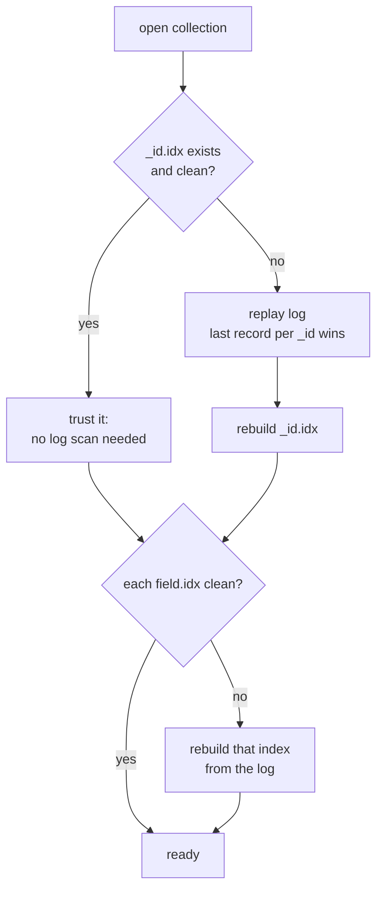
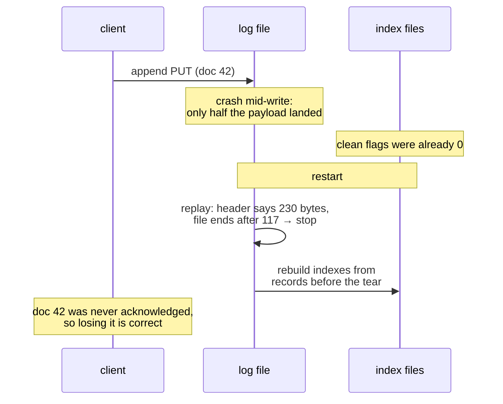

# The storage layer

Each collection's documents live in exactly one file: an append-only record log. This page
explains the format, the crash-safety reasoning, and why "append-only plus rebuildable
indexes" beats cleverer designs for a database you intend to fully understand.

## Record framing

`<collection>.log` is a flat sequence of records:

| Offset | Size | Field |
|---|---|---|
| 0 | 1 | type: `01` = PUT, `02` = DEL |
| 1 | 4 | payload length, u32 little-endian |
| 5 | n | payload |

A **PUT** payload is a complete BSON document (which must carry an `ObjectId` `_id`; one is
generated if absent). A **DEL** payload is the 12 `_id` bytes. That's the entire format.

Updates do not modify bytes in place. An update appends a new PUT for the same
`_id`; a delete appends a DEL. The old record becomes garbage that
[compaction](#compaction) reclaims later. Note the BSON payload carries its own length and
strict internal validation, so a corrupted record body is detected at decode time even
though the log has no separate per-record checksum.

## Replay: the recovery rule

> **Replaying the log front to back, letting the last record per `_id` win, reconstructs
> the exact live document set.**

This is the contract everything else leans on. The `_id` index maps ids to PUT offsets, and
secondary indexes map field values to ids, but both are *derived*. The startup sequence
makes that concrete:

"Clean" is a one-byte flag in each index file's header: cleared (and flushed) before the
first write of a session, set again only after a full successful flush. A crash at any
point leaves it cleared, and the next open pays an O(n) rebuild instead of trusting
possibly-torn pages. Indexes are caches; the log is the database.

## Torn writes

What if the crash happens *during* an append? The replay loop reads a record header, checks
that the full payload fits within the file, and **stops silently at the first incomplete
record**. A torn tail is defined as data not yet written, rather than corruption:

The torn record was never acknowledged to the client (responses are
sent after the append returns), so dropping it preserves exactly the guarantee that was
promised. There is no half-applied state because nothing besides the log needs to be
consistent.

## Why this design

The classic alternatives and what they would cost here:

- **Update-in-place (heap files)** needs free-space management, record relocation when
  documents grow, and write-ahead logging to make any of it crash-safe. This requires a WAL *plus* the
  files it protects, whereas the append-only log **is** its own WAL.
- **A full WAL + page-store** (the SQLite/Postgres shape) is the production answer, but it
  doubles the moving parts. With one append-only file, fsync discipline reduces to "flush
  the log"; recovery reduces to "find the tear."
- The tradeoff: reads need an index lookup plus a seek (no clustering), deleted space
  accumulates until compaction, and startup after an unclean shutdown is O(data). For a
  single-node educational engine, all three are the right price.

## Compaction

`compact` rewrites the log keeping only live PUT records (in `_id`-index order), fsyncs the
new file, then atomically renames it over the old one. Since every stored offset just
changed, all indexes are rebuilt afterward. Simple beats subtle here; remapping offsets
in-place was rejected as complexity with no observable benefit at this scale. A crash
mid-compaction is safe: the rename is the commit point, and until it happens the original
log is untouched.

## Tombstones and space

A deleted document costs 17 bytes of DEL record forever-until-compaction, and its old PUT
remains as dead weight. `dbStats` reports per-collection file sizes so the moment to compact
is visible rather than mysterious.
